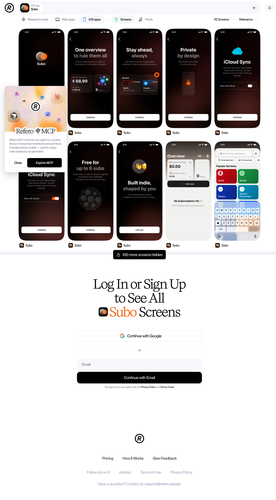
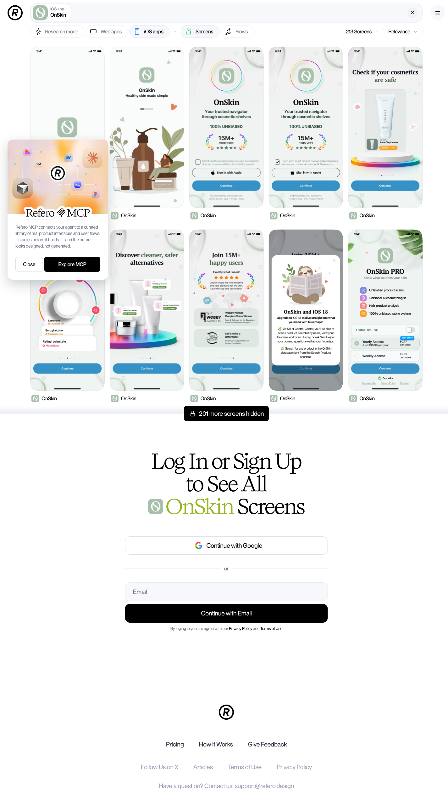
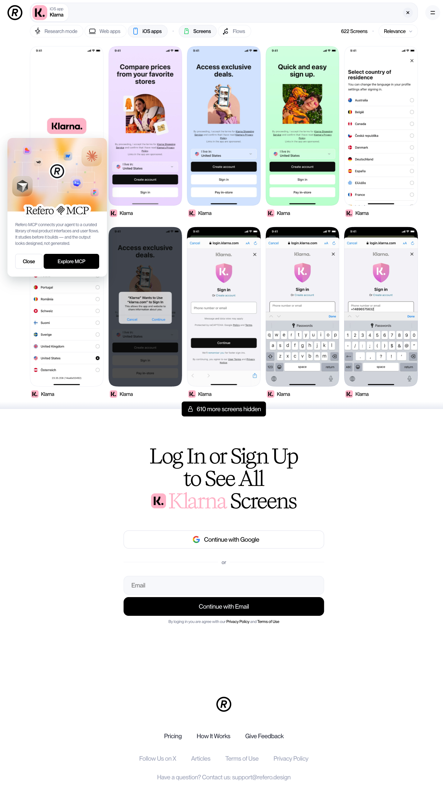
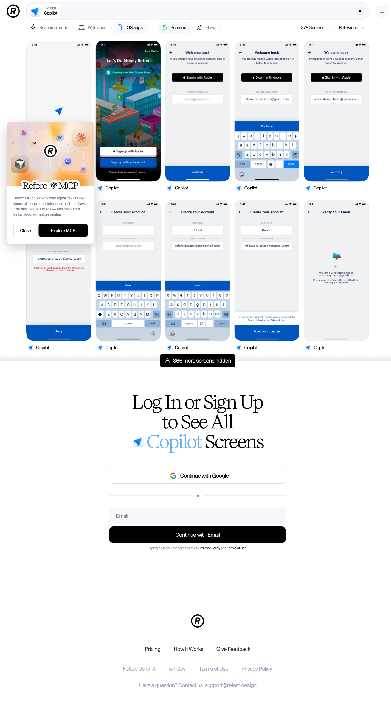
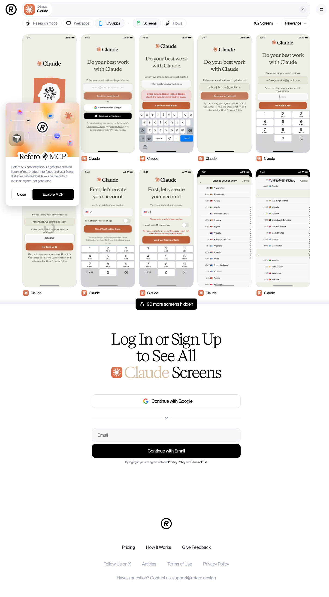
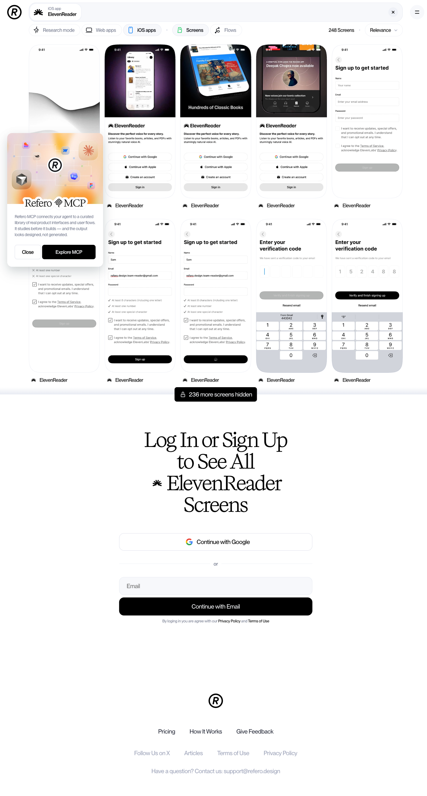

# 17. Refero.design как источник UI-референсов для Decode

**Дата:** 12.06.2026 · **Метод:** Playwright-обход публичных страниц (без логина), публичные JSON-каталоги (`/json/apps.json`, `/json/sites.json`), docs MCP, поиск по индексу Google.

---

## Что такое Refero

[Refero](https://refero.design/) — «Design research for AI era»: курируемая библиотека реальных продуктовых интерфейсов **Web + iOS** (Android нет). Заявленные объёмы:

- **132 000+ скринов**: ~68 000 web + ~64 000 iOS, обновления еженедельно
- **10 000+ user flows** (пошаговые флоу «от регистрации до удаления аккаунта»)
- **402 web-продукта** и **285 iOS-приложений** (точные числа из публичных JSON-каталогов)
- Таксономия: **45 Page Types, 44 Flows, 87 UX Patterns, 69 UI Elements**, плюс фильтры по шрифтам и цветам (hex)

Три отличия от классических галерей:

1. **Research mode** — AI-поиск: описываешь задачу текстом → получаешь анализ, референсы и reasoning (доступно только залогиненным).
2. **Refero MCP** (`https://api.refero.design/mcp`) — MCP-сервер для AI-агентов (Claude Code, Cursor и др.): тулы `refero_search_screens`, `refero_get_screen`, `refero_get_similar_screens`, `refero_get_screen_image`, `refero_search_flows`, `refero_get_flow`, `refero_search_styles`. Каждый скрин отдаётся со структурированной метадатой (page_types, ux_patterns, ui_elements, цвета, описание layout). Docs: [doc.refero.design/mcp/tools](https://doc.refero.design/mcp/tools). **Входит только в Pro.**
3. **Refero Skill** — методология «сначала ресёрч референсов, потом дизайн» для агента: `npx skills add https://github.com/referodesign/refero_skill`.

Также есть Figma-плагин (референсы прямо в Figma, Pro).

## Бесплатные лимиты и цены

| Уровень | Что видно | Цена |
|---|---|---|
| **Без логина** | Главная (меню категорий), pricing, /mcp; страница одного скрина с метадатой (по прямой ссылке); превью поиска: ~10 скринов / 3 флоу на запрос, остальное «Log In to See All». Каталог и сетка поиска закрыты (редирект/404). | 0 |
| **Free-аккаунт** | **~3% библиотеки**, «basic search» по тегу/компании. Research mode, флоу целиком, MCP — нет. | 0 |
| **Pro** | Вся библиотека Web+iOS, флоу, Figma-плагин, **MCP**, Refero Skill | **€17/мес** помесячно, **€10/мес** при годовой (€120/год), **€250 lifetime**; студентам −40% |
| **Team** | Pro + collaborative bookmarks, per-seat | €20/мес или €12/мес при годовой (€140/год/место) |

Оплата Stripe. Вывод: **без Pro Refero почти бесполезен для систематической работы** — но превью по прямым URL (10 скринов/приложение) хватает для «разведки», а lifetime за €250 / €10 в месяц заметно дешевле Mobbin Pro.

## URL-паттерны (важно: web и iOS — разные пути)

- iOS-приложение: `https://refero.design/apps/{id}` → редирект на `/apps/search?app_id[id][]={id}`
- iOS-поиск по фильтру: `https://refero.design/apps/search?page_types[id][]=13&order=trending`
- iOS-флоу: `https://refero.design/apps/search/flows?flow_types[id][]=1&order=trending`
- Web-поиск: `https://refero.design/search?...`, web-флоу: `/search/flows?...`
- Один скрин: `https://refero.design/screens/{uuid}` (публично, с метадатой)

## Релевантные iOS-приложения в библиотеке (shortlist для фазы wireframes)

Прямые ссылки, без логина видно ~10 скринов на каждое:

**Finance / BNPL (контекст Decode):**
1. **Klarna** — BNPL, платежи: https://refero.design/apps/50 ← главный BNPL-референс
2. **PayPal** — «Savings, cash back, pay later»: https://refero.design/apps/213
3. **Revolut**: https://refero.design/apps/74
4. **Wise** (393 скрина): https://refero.design/apps/39
5. **Copilot** — spending/net worth, эталон finance-dashboard: https://refero.design/apps/100
6. **Dime** — личный трекер трат, минимализм: https://refero.design/apps/16
7. **Orbit** — expense tracker: https://refero.design/apps/255
8. **Introspect** — «Improve your buying habits» (поведенческий ангел Decode): https://refero.design/apps/281

**Bills / renewals (прямой аналог Renewal Radar):**
9. **Subo** — «Bills, renewals & reminders»: https://refero.design/apps/237 ← открыть первым

**Scan → Understand (паттерн Trap Detector):**
10. **OnSkin** — «Cosmetic Ingredient Checker»: сканируешь состав → объяснение + флаги вредных ингредиентов. Структурно это и есть наш trap detector, только для косметики: https://refero.design/apps/143
11. **Foodvisor** — фото еды → разбор калорий: https://refero.design/apps/92
12. **Plantum** — фото → идентификация → инструкция: https://refero.design/apps/184
13. **Chance AI** — Visual Search: https://refero.design/apps/215
14. **CapWords** — photo translate (camera-first UX): https://refero.design/apps/196

**AI-ассистенты (язык объяснений, trust-паттерны):**
15. **Claude**: https://refero.design/apps/119
16. **ChatGPT**: https://refero.design/apps/29
17. **Perplexity** (цитирование источников — важно для доверия): https://refero.design/apps/73
18. **Kin** — privacy-focused AI assistant (приватность = наш аргумент для Vault): https://refero.design/apps/183

**Документы / Vault:**
19. **ElevenReader** — reader для PDF и документов: https://refero.design/apps/242
20. **mymind** — «save anything», личный визуальный архив: https://refero.design/apps/3

Web-каталог (для лендинга, не для приложения): Revolut (13), Wise (313), Klarna (272), PayPal (162), Mercury (857), Monarch Money (722), Stripe (9), RevenueCat (76) — формат `refero.design/search?site_id[id][]={id}`.

## Релевантные фильтры-категории (iOS: подставлять в `/apps/search?...`)

| Категория | Фильтр | Зачем Decode |
|---|---|---|
| Camera & Scanner | `design_patterns[id][]=167` | Scan-флоу, экран камеры |
| Permission | `design_patterns[id][]=114` | Запрос камеры/уведомлений |
| Paywall & Subscription | `page_types[id][]=13` | Монетизация |
| Cancel Subscription | `page_types[id][]=48` | Управление подпиской |
| Walkthrough / Welcome | `page_types[id][]=22` / `=4` | Онбординг |
| Sign Up / Log In | `page_types[id][]=19` / `=18` | Регистрация |
| Wallet & Balance | `page_types[id][]=11` | Finance-home |
| Billing & Plans | `design_patterns[id][]=213` | Тарифы, true cost |
| Payment Method | `design_patterns[id][]=137` | Платёжные данные |
| Activity & Notification Feed | `design_patterns[id][]=223` | Renewal Radar лента |
| Notifications & Toast | `page_elements[id][]=83` | Алерты |
| Timeline & History | `design_patterns[id][]=173` | История документов |
| Files | `design_patterns[id][]=152` | Vault |
| Chat Bot | `design_patterns[id][]=208` | AI-объяснение |
| Empty State | `design_patterns[id][]=116` | Пустой Vault |
| Stats / Pie & Donut Chart | `page_elements[id][]=106` | Разбивка стоимости |
| Bottom Sheet | `page_elements[id][]=122` (/121 expanded) | iOS-паттерн деталей |
| Onboarding flows (138 шт.) | `/apps/search/flows?flow_types[id][]=1` | Целые флоу |

## Refero vs Mobbin: когда что

| | **Mobbin** (research/12–16) | **Refero** |
|---|---|---|
| Объём | ~1M+ скринов, тысячи приложений, iOS+Android+Web | 132k скринов, 285 iOS-приложений, Web+iOS |
| UK-финтех | Monzo, Starling, Emma, Snoop, Cleo и т.д. — есть | **Нет** UK-необанков; из финтеха: Klarna, Revolut, Wise, PayPal, Coinbase + индюшные трекеры |
| Селекция | Широкая, «всё подряд» | Курируемая, перекос в craft/indie-приложения высокого визуального качества (Not Boring, amo, Family) |
| Метадата | Скрины + флоу | Структурная метадата каждого скрина (паттерны, элементы, цвета, layout) |
| AI-интеграция | — | **MCP + Skill + Research mode** — агент сам ищет референсы |
| Цена | ~$24/мес | €10/мес (годовая), €250 lifetime |

**Практическое правило для Decode:**
- **Mobbin** — основной источник по конкурентному полю: UK-финтех, BNPL-флоу конкретных брендов, breadth.
- **Refero** — (1) паттерн-уровень: «как вообще делают Camera & Scanner / Paywall / Bills-reminders на iOS», (2) визуальное качество и craft-референсы, (3) **агентный ресёрч**: при Pro-подписке подключить Refero MCP в Claude Code — на фазе wireframes агент сам подтягивает референсы под каждый экран («Find bill reminder screens from iOS finance apps»).

## Что не удалось посмотреть без логина/подписки (честно)

- Сетки поиска и полные галереи приложений: видно только ~10 скринов-превью на запрос; «383 more screens hidden» (Wise) и т.п.
- Флоу целиком: в превью 3 флоу, шаги не раскрываются.
- Research mode и live-demo чата (chat.refero.design) — редирект на главную.
- MCP — требует Pro; тулы изучены только по [документации](https://doc.refero.design/mcp/tools).
- Глубину покрытия конкретных приложений (например, есть ли у Klarna в библиотеке именно экраны BNPL-agreement) проверить нельзя — нужен хотя бы free-аккаунт (но он открывает только ~3% библиотеки).
- Полный справочник ID для всех 44 flow types и 87 UX patterns (вытащены только те, что засвечены на главной и pricing).

## Key takeaways for Decode

1. **Subo (apps/237) — самый ценный единичный референс**: iOS-приложение ровно про «bills, renewals & reminders», т.е. готовый бенчмарк для Renewal Radar. Открыть первым на фазе wireframes.
2. **OnSkin (apps/143) — структурный двойник нашего core loop**: scan состава → plain-language объяснение → флаги «ловушек». Перенять механику подачи результата скана.
3. **Для UK-финтеха Refero не заменяет Mobbin** — Monzo/Starling/Emma/Snoop там нет; зато Klarna, Revolut, Wise, PayPal, Copilot покрывают BNPL и finance-home.
4. **Refero — это «Mobbin для AI-агентов»**: если берём подписку, главная ценность не галерея, а MCP в Claude Code — автоматический подбор референсов с метадатой под каждый экран при генерации wireframes. На фазе wireframes это может заменить ручной скрин-серфинг.
5. **Бесплатно работаем так**: прямые URL приложений из shortlist (по 10 скринов превью) + страницы одиночных скринов из Google-индекса (`site:refero.design/screens <запрос>`). Для системной работы нужен Pro: разумнее всего €10/мес годовая или дождаться фазы UI и взять 1 месяц за €17.
6. **Камера/скан-флоу искать через фильтр** `design_patterns[id][]=167` (Camera & Scanner) и Permission (114) — на Mobbin такой точной паттерн-таксономии нет, это сильная сторона Refero.

## Сохранённые превью (без логина, ~10 экранов на приложение)

Скриншоты публичных страниц шорт-листа, снято 2026-06-12, desktop 1440px, full-page:

| Приложение | Зачем нам | Файл |
|---|---|---|
| Subo (apps/237) | бенчмарк Renewal Radar: onboarding value props, overview-сумма, empty state, выбор популярных сервисов |  |
| OnSkin (apps/143) | двойник core loop: scan → объяснение → флаги |  |
| Klarna (apps/50) | BNPL-механика, подача платежей |  |
| Copilot (apps/100) | finance-home, иерархия чисел |  |
| Claude (apps/119) | язык AI-объяснений, trust-паттерны |  |
| ElevenReader (apps/242) | документы/библиотека → референс Vault |  |

Полные галереи («100+ more screens hidden») — за логином; добирать точечно на фазе wireframes (free-аккаунт или Pro €17/мес с MCP).
