# Hi-fi мудборд для Decode (фаза дизайна)

Визуальные референсы под **будущую фазу дизайна** (сейчас — ч/б wireframes, дизайн отложен). Цель — наполнить решения по тёмной теме, эстетике «декодирования», карточкам и шрифтам. Снято 2026-06-14: refero (full-page PNG) + Mobbin (отдельные экраны, .webp, скачаны по image_url; каждый — с `mobbin_url`).

> Дополняет уже собранные refero-референсы в [../refero/](../refero/): **Copilot** (`refero-copilot-apps100.png`) — эталон dark-finance + крупные числа; **Klarna/Claude/ElevenReader** — наш домен/AI.
> Честно: refero-поиск и Research mode за Pro; без логина брал app-страницы (~10 превью). Mobbin использован для целенаправленно тёмных экранов (refero-приложения чаще светлые).

---

## 1. Тёмные цветовые схемы (приоритет — «в тёмных цветах»)

| Референс | Что интересного для Decode | Источник |
|---|---|---|
| 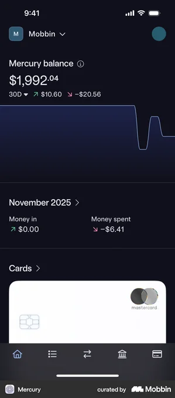 **Mercury** | Почти чёрный фон (#0E0E11-зона), крупное «$1,992.04» с мелким суффиксом, тонкий line-chart на тёмном, дельты ↗↘ как акценты. Палитра под наш `gray-0/950` dark + aha-число | [mobbin](https://mobbin.com/screens/f1e10eb9-dfe8-4817-8e82-43272bc17ede) |
| 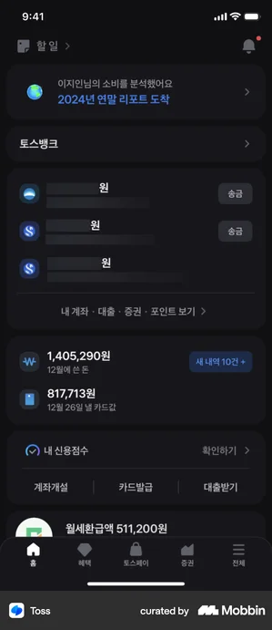 **Toss** | Глубокий тёмный, секции-карточки на чуть более светлом фоне (`card` vs `background`), числа разрядно (tabular), кредит-скор строкой. Близко к нашему cockpit dark | [mobbin](https://mobbin.com/screens/d8af309c-6543-4750-9acc-77215f009c69) |
| 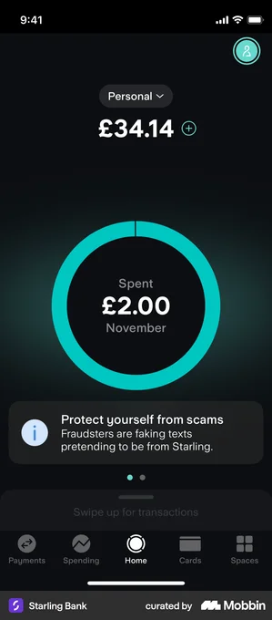 **Starling Bank** | Чёрный фон, бирюзовый акцент-кольцо вокруг крупной суммы, спокойный info-баннер на тёмном (анти-алармизм — наш тон). Один яркий акцент на нейтральном тёмном | [mobbin](https://mobbin.com/screens/aaaf526e-905a-4e12-a5f7-ec0ae4aa8ab6) |
|  **Crypto.com** | Тёмно-синий фон, segmented-фильтры (24H/1W/1M — как наш RangeToggle 7/30/60), строки-обязательства с £ справа. Структура списка под cockpit | [mobbin](https://mobbin.com/screens/82434aa8-3646-47f3-8c93-8e7400515a3c) |
| 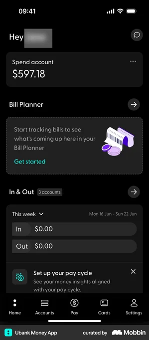 **Ubank** | Чёрный, **Bill Planner**-карточка с иллюстрацией (наш Radar/empty-state), «In & Out» строки, мягкие тёмные карточки с тонкой границей. Прямой аналог нашего «renewing soon» | [mobbin](https://mobbin.com/screens/d738346c-df32-4ebc-9e45-14a6a7269f81) |
| 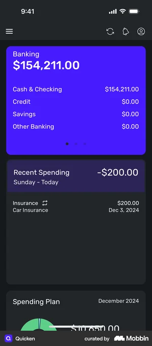 **Quicken** | Тёмный фон + **один яркий цветной hero-блок** (banking $154,211) — приём «герой-число в цветной плашке на тёмном». Кандидат для нашего headline/aha-числа | [mobbin](https://mobbin.com/screens/4053ef4f-c497-4691-b541-b99c55025d22) |
| 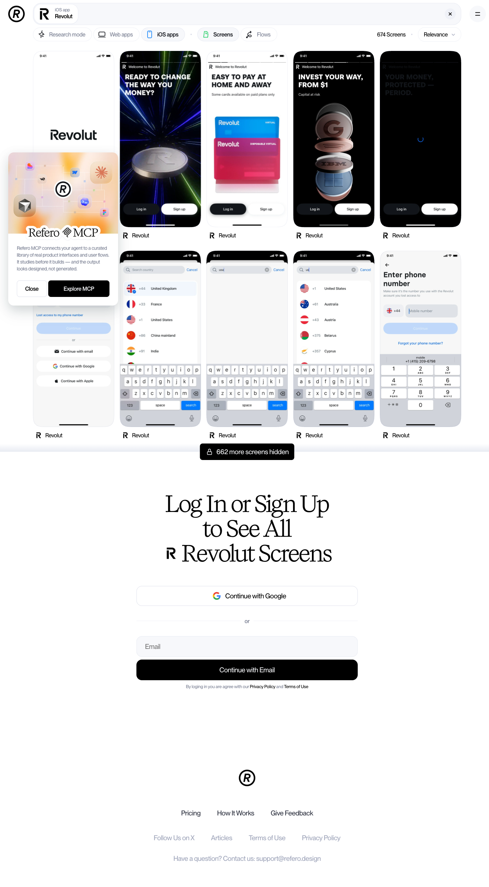 **Revolut** (refero) | Dark-онбординг: жирные CAPS-заголовки на чёрном, vibrant-акценты, продукт показан крупно. Референс под наш онбординг dark + сильную типографику | [refero/apps/74](https://refero.design/apps/74) |

**Вывод по тёмному:** доминирует near-black фон (`#0E0E11`–`#16161A`), карточки на ступень светлее (`#1D1D22`–`#26262C`) — ровно наша dark-пара примитивов; **один** насыщенный акцент на нейтрали (бирюза Starling / синий Crypto / фиолетовый Quicken); крупные суммы tabular с мелким суффиксом валюты.

## 2. Эстетика «декодирования» / AI-разбор

| Референс | Что интересного для Decode | Источник |
|---|---|---|
| 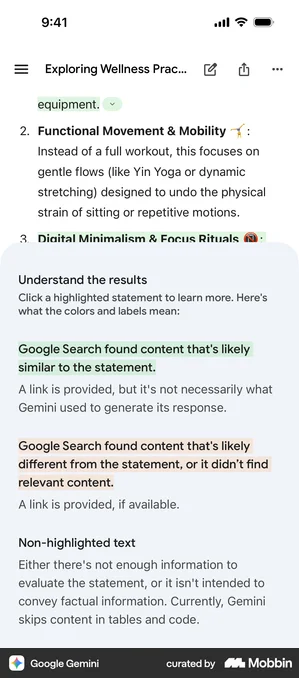 **Gemini «Understand the results»** ⭐ | **Легенда подсветки**: зелёное = «подтверждено источником», оранжевое = «отличается/не найдено», без подсветки = «недостаточно данных». Прямой прообраз нашего **confidence/три-языка-достоверности** (from document / check this / couldn't read) | [mobbin](https://mobbin.com/screens/3c708786-b2c1-4716-aa33-8e2362afdfe8) |
| 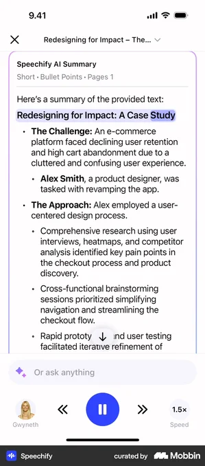 **Speechify AI Summary** | Summary с **подсвеченными фрагментами** прямо в тексте + «Short · Bullet Points · Pages 1» мета. Паттерн «AI-объяснение со ссылкой на место» — наш decode-result + QA-src | [mobbin](https://mobbin.com/screens/a46870ea-3024-47b2-b57f-e98b4fcdbc95) |
| 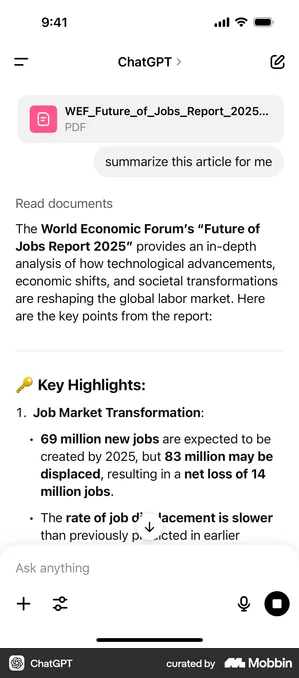 **ChatGPT** | Прикреплённый PDF → «Key Highlights» с **жирными числами в тексте** («69 million new jobs», «net loss of 14 million»). Как подавать ключевые цифры в plain-English summary | [mobbin](https://mobbin.com/screens/d3a1dc1d-0cfb-4539-b52c-e685be6e70bf) |
| 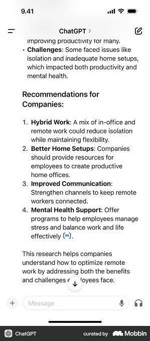 **ChatGPT** | Нумерованные «Recommendations» с жирным лид-словом + пояснением. Структура наших trap-карточек / key-terms | [mobbin](https://mobbin.com/screens/1fcc1931-661f-4f13-be2b-3a54eb6b2d67) |
| 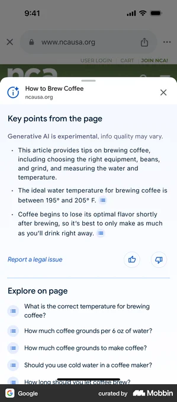 **Google «Key points»** | «Generative AI is experimental, info quality may vary» + иконки-ссылки на источник у каждого буллета + thumbs. Дисклеймер + source-привязка (но НЕ глобальная плашка — у нас контекстная) | [mobbin](https://mobbin.com/screens/22bad4e9-2b75-4cac-904d-3f259b5b5d53) |
| 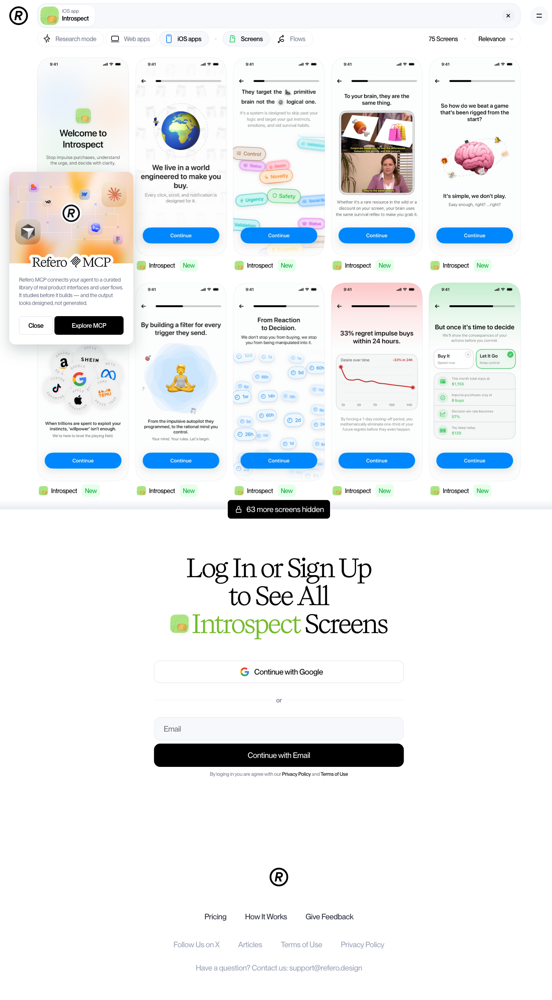 **Introspect** (refero) | Светлые пастельные AI-карточки с разбором/инсайтами, chart-«impulse buys», цветные теги-лейблы. Референс под наши key-term лейблы и insight-подачу | [refero/apps/281](https://refero.design/apps/281) |

## 3. Card-элементы

- **Ubank Bill Planner** и **Crypto строки** — карточка-обязательство: иконка + название + £ справа + дельта; мягкая тёмная заливка + тонкая граница (`card`/`border` роли).
- **Quicken hero-card** — цветная плашка для headline-числа поверх тёмного списка.
- **Introspect** — пастельные insight-карточки с тегами (наши `RiskLabel`/key-terms).
- **Starling info-баннер** — спокойное предупреждение в карточке (анти-алармистский trap-тон).

## 4. Типографика и шрифты

- **Крупные числа:** Mercury/Toss/Starling/Quicken — суммы очень крупно, **tabular**, суффикс валюты мельче и приглушён. Прямой паттерн нашего `figures-lg` / aha-числа.
- **Жирные CAPS-заголовки:** Revolut-онбординг — сильная иерархия на тёмном (для value-prop экранов).
- **Editorial-засечки/контраст:** Kin (`refero-kin-apps183.png`) — тёплый, «Personal guidance. Always private.» крупным редакторским шрифтом. Кандидат для бренд-голоса (но проверить читаемость в продукте).
- Большинство финтехов — системный SF Pro (совпадает с нашим стеком); характер задаётся весом и размером, не экзотическим шрифтом.

## 5. Прочий craft (severity / confidence / доверие)

- **Gemini-легенда** — эталон того, как объяснить пользователю систему меток (наш confidence: ✓/check/couldn't read).
- **Starling info-карточка** — спокойный регистр предупреждения (наш trap-тон без красного алармизма).
- **Google source-иконки + thumbs** — source-привязка к каждому утверждению + feedback (наш «tap to see in document» + thumbs/«Wrong?»).

---

## Гипотезы для дизайн-фазы Decode

1. **Тёмная палитра-кандидат:** near-black фон `#0E0E11–#16161A`, карточки на ступень светлее `#1D1D22–#26262C`, тонкие границы `#26262C–#33333A` — это уже заложено в [DESIGN.md](../../../docs/DESIGN.md) dark-примитивах. **Один** насыщенный brand-акцент на нейтрали (не радуга): кандидаты — спокойный сине-зелёный (Starling/«trust») либо холодный синий. Семантику (trap-red/amber, credit-file green/red) держать приглушённой на тёмном, различимость дублировать иконкой/весом.
2. **Aha-число:** подавать как Mercury/Quicken — очень крупно, tabular, валюта-суффикс мельче; на тёмном можно в цветной hero-плашке (Quicken-приём) для шок-эффекта «True cost £412».
3. **Шрифт:** базовый SF Pro (наш стек); характер — через вес/размер. Editorial-засечный акцент (Kin-стиль) рассмотреть только для онбординг-заголовков, не для данных.
4. **Result-карточка:** структура ChatGPT/Speechify — plain-English summary с жирными числами + подсвеченные фрагменты со ссылкой на источник; trap/key-terms как нумерованные карточки с жирным лид-словом (ChatGPT-keypoints).
5. **Confidence/source-легенда:** взять модель Gemini «Understand the results» — явная легенда меток (from document / check this / couldn't read) + source-иконки Google-стиля у каждого утверждения. Это закрывает наш PM6 (три языка достоверности) визуально.
6. **Тон:** Starling-регистр предупреждений (спокойная карточка), НЕ кроваво-красный — совпадает с продуктовым принципом «спокойный безоценочный эксперт».

**Когда возьмём refero Pro** — добрать через MCP целевые dark + scanner/decoding флоу прямо под наши экраны (см. [research/17](../../17-refero-references.md)).
